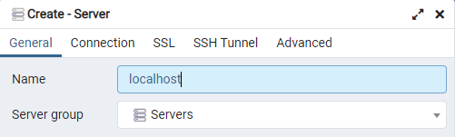
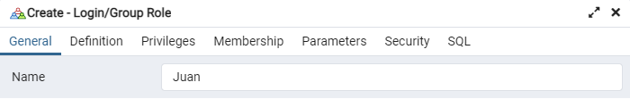

## Manual de instalación de Odoo 15.0 en Windows 11

## Requerimientos   

 - Python **3.8.10**        
 - VS Build Tools **16.11.4** 
 - Wkhtmltopdf **0.12.5-1**
 - Postgresql **13.4**     
 - Odoo **15.0**           


## 1. Instalación de Python

Una vez terminada la instalación, el **path** se encuentra generalmente en la siguiente ubicación: C:\Users\\...\AppData\Local\Programs\Python\Python38

**La ejecución del comando de actualización del pip es opcional** 
```
python -m pip install --upgrade pip 
```

## 2. Instalación de VS Build Tools 

Una vez descargada la versión [**VS Build Tools 3.8.10**](https://visualstudio.microsoft.com/es/downloads/), se deberá instalar, seleccionando las opciones, mostradas en la [***ilustración adjunta***](images/library_.png)  


## 3. Instalación de herramientas de línea de comandos

Se deberán instalar las herramientas de línea de comandos de código abierto [**wkhtmltopdf-0.12.5-1**](https://github.com/wkhtmltopdf/wkhtmltopdf/releases/tag/0.12.5), destinadas a la conversión de HTML a PDF 

## 4. Instalación de PostgreSQL

Crear una nueva conexión con el servidor de PostgreSQL, para este caso la llamaremos **localhost** y en el **Tab** ***Connection***, se deberá ingresar un **Password**  



A continuación se deberá crear un Rol para gestionar la Base de Datos, para este caso el **Nombre del Rol** es: ***Juan***, en el **Tab** **Definition**, se deberá ingresar un **Password**



En el **Tab Privileges**, se deberán habilitar las opciones: ***Can login, Create databases*** y ***Inherit rights from the parent roles***, tal como se muestra en la [***ilustración adjunta***](images/i_post__7.png)

## 5. Clonación del Repositorio de Odoo 15.0 

Una vez seleccionada la [**versión 15.0 de Oddo**](https://github.com/odoo/odoo/tree/15.0), se creará un directorio (carpeta), donde se ejecutará el siguiente comando: 
```
git clone https://github.com/odoo/odoo.git --depth=1 -b 15.0 
```
Las expresiones: ***--depth=1 -b 15.0***, corresponden a la última versión de Odoo 15.0 y procederemos a ejecutar el siguiente comando: 

```
pip install setuptools wheel
```
A continuación, en el directorio de clonación se deberá de editar el archivo : **requeriments.txt**, de la siguiente manera: <br>

libsass==**0.21.0** <br>
cryptography==**3.4.8** <br>
passlib==**1.7.2** <br>
python-stdnum==**1.16** <br>

## 6. Instalación de ***venv*** Python (Entorno Virtual de Python) 

***Únicamente*** en el caso, que no se ejecutacen los comandos de Python, se deberán utilizar los siguientes comandos, en una terminal con permisos de **Administrador**
```
Get-ExecutionPolicy
```
```
Get-ExecutionPolicy -List
```
```
Set-ExecutionPolicy  -ExecutionPolicy AllSigned
```
Una vez superados los pasos anteriores se deberá ejecutar el siguiente comando en la ruta: **C:\Users\admin>**
```
pip install virtualenv
```
Para crear los Scripts del proyecto se deberá ejecutar el siguiente comando en la ruta (Ejemplo): **C:\Users\admin\Projects\odoo>** 
```
python -m venv ./venv
```
Una vez ejecutado el comando anterior se crea el siguiente directorio **C:\Users\admin\Projects\odoo\venv\Scripts**

**Entorno virtual de Python**

Para habilitar el ***entorno virtual***, se deberá ejecutar el siguiente comando en un ***terminal con privilegios de Administrador***, en  la ruta (Ejemplo): **C:\Users\admin\Projects\odoo>**
```
.\venv\Scripts\activate
```
Si todos los pasos anteriores se realizaron satisfactoriamente el ***Prompt***, tendrá el siguiente aspecto: ***(venv)*****PS C:\Users\admin\Projects\odoo>**

**Para la instalación de todas las dependencias del proyecto, se ejecutará el siguiente comando:**

```
pip install -r requirements.txt
```

## 7. Ejecución de Odoo 15.0

Se abrirá un terminal y se ejecutará el siguiente comando:

```
python odoo-bin -d odoo15 -r Juan -w mi_password
```

El **parametro: -d odoo15** es la conexión del servidor creada en la **Sección 4. Instalación de PostgreSQL**

El **parametro: -r Juan** es el nombre del Rol, asignado en la **Sección 4. Instalación de PostgreSQL**

El **parametro: -w mi_password** es el password del Rol, asignado en la **Sección 4. Instalación de PostgreSQL**

Para Finalizar, si los pasos anteriores se realizaron satisfactoriamente se deberá abrir un navegador web y utilizar la siguiente URL:
```
http://localhost:8069
```