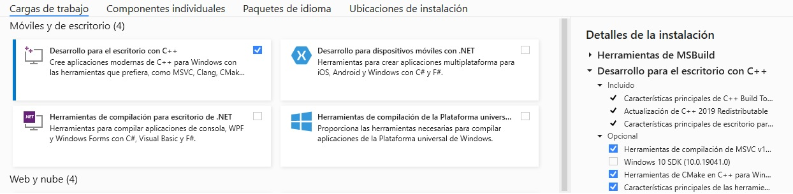
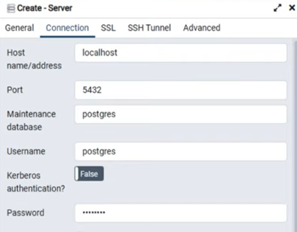
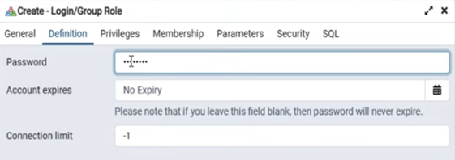
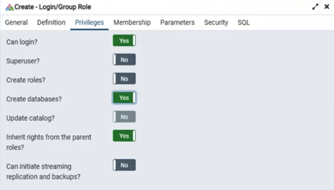
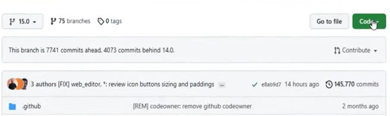

## Manual de Instalación de Oddo 15.0 en Windows 11

## Requerimientos 

 - Python **3.8.10**        
 - VS Build Tools **16.11.4** 
 - Wkhtmltopdf **0.12.5-1**   
 - Git **2.33.0**            
 - Postgresql **13.4**     
 - Odoo **15.0**           


## 1. Instalación de Python

La ruta del path se debería encontrarse en las siguientes rutas:
```
C:\Users\......\AppData\Local\Programs\Python\Python38  |   C:\Users\......\AppData\Local\Programs\Python\Python38\Scripts 
```
**La actualización del pip es opcional** 
```
python -m pip install --upgrade pip 
```

## 2. Instalación de VS Build Tools [>](https://visualstudio.microsoft.com/es/downloads/)

Una vez descargada la versión VS Build Tools 3.8.10, se debe seleccionar las opciones, mostradas en la siguiente ilustración: 



## 3. Instalación de herramientas de línea de comandos (wkhtmltopdf)[>](https://github.com/wkhtmltopdf/wkhtmltopdf/releases/tag/0.12.5)

Descargar las herramientas de línea de comandos de código abierto (LGPLv3) para convertir HTML en PDF y varios formatos de imagen utilizando el motor de renderizado Qt WebKit. La versión a descargar es la siguiente:
```
wkhtmltox-0.12.5-1.msvc2015-win64.exe
```

## 4. Instalación de Git  

Descargar e instalar de preferencia la versión 2.33.0


## 5. Instalación de PostgreSQL

En la instalación se deberan seleccionar los items señalados en las siguientes ilustraciones:

A continuación se deberá crear una nueva conexión con el servidor de PostgreSQL, para este caso la llamaremos ***localhost***


En el Tab ***Connection***, se deberá ingresar un Password



A continuación se deberá crear un Rol para gestionar las Bases de Datos [(Creación del Rol)](images/i_postgresql__4.png)






## 6. Clonación del Repositorio de Odoo 15.0 [>](https://github.com/odoo/odoo)

Se deberá crear un directorio (carpeta), en la ubicación que el usuario a bien tuviere hacerlo, para clonar el repositorio de Odoo

Una vez seleccionada la versión 15.0 de Oddo, procedemos a seleccionar el comando de clonación



Ejecutaremos el siguiente comando :
```
$ git clone https://github.com/odoo/odoo.git --depth=1 -b 15.0 
```
La **expresión**: $ ***git clone***, es propia del comando de clonación  

La **expresión**: ***https://github.com/odoo/odoo.git***, corresponde al comando de clonación de Odoo  

La **expresión**: ***--depth=1 -b 15.0***, corresponde a la última versión de Odoo 15.0


Una vez clonado el repositorio de Odoo 15.0, se deberá ingresar en la carpeta creada, llamada odoo y se ejecutará el siguiente comando:
```
C:\odoo\odoo>pip install setuptools wheel
```

A continuación, en el directorio de clonación se deberá de editar el archivo : ***requeriments.txt***, de la siguiente manera:

```
python-stdnum==1.16
libsass==0.21.0
passlib==1.7.2
cryptography==3.4.8
```

## 7. Instalación de ***venv*** Python (Entorno Virtual de Python) 

***Únicamente en el caso***, que no se ejecutacen los comandos de Python en las carpetas de Windows, se deberán utilizar los siguientes comandos: 

**Paso 1:**
```
C:\Users\admin\Projects\odoo> Get-ExecutionPolicy
```
**Paso 2:**
```
C:\Users\admin\Projects\odoo> Get-ExecutionPolicy -List
```
**Paso 3:**
Se deberá abrir otra terminal con **permisos de Administrador** y ejecutar el siguiente comando:
```
C:\Users\admin>Set-ExecutionPolicy  -ExecutionPolicy AllSigned
```

**Una vez superados los pasos anteriores se deberá ejecutar el siguiente comando en la ruta (Ejemplo):**
```
C:\Users\admin>pip install virtualenv
```
**Para crear los Scripts del proyecto se deberá ejecutar el siguiente comando en la ruta (Ejemplo):** 
```
C:\Users\admin\Projects\odoo>python -m venv ./venv
```
Una vez ejecutado el comando anterior se deberían crear los siguientes directorios 
```
C:\Users\admin\Projects\odoo\venv\Scripts
```
Para habilitar el ***entorno virtual*** de Python, se deberá ejecutar el siguiente comando en un ***terminal con privilegios de Administrador***, en  la ruta (Ejemplo):
```
C:\Users\admin\Projects\odoo> .\venv\Scripts\activate
```
Se deberá seleccionar la opción [E] Ejecutar para siempre, y si todos los pasos anteriores se realizaron satisfactoriamente el ***Prompt***, tendrá el siguiente aspecto:
```
(venv)PS C:\Users\admin\Projects\odoo>
```
**Para la instalación de todos los requerimientos de la instancia de odoo en la computadora local, se ejecutará el siguiente comando:**

```
(venv)PS C:\Users\admin\Projects\odoo> pip install -r requirements.txt
```

## 8. Ejecución de Odoo 15.0

Se abrirá un terminal y se ejecutará el siguiente comando:

```
(venv)PS C:\Users\admin\Projects\odoo> python odoo-bin -d odoo15 -r graham -w mypassword
```

El **parametro: -d odoo15** es la conexión del servidor creada en la Sección 4. Instalación de PostgreSQL 13.4 

El **parametro: -r graham** es el nombre del Rol, asignado en la Sección 4. Instalación de PostgreSQL 13.4

El **parametro: -w mypassword** es el password del Rol, asignado en la Sección 4. Instalación de PostgreSQL 13.4

Para Finalizar, si los pasos anteriores se realizaron satisfactoriamente se deberá abrir un navegador web y escribir la siguiente URL:
```

http://localhost:8069

```